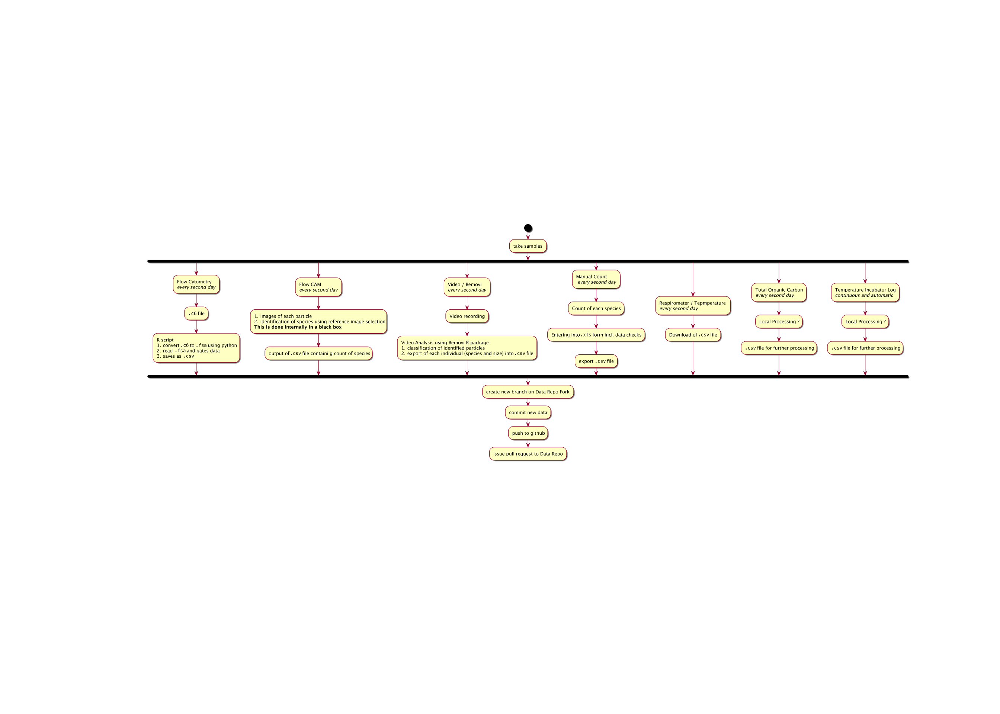
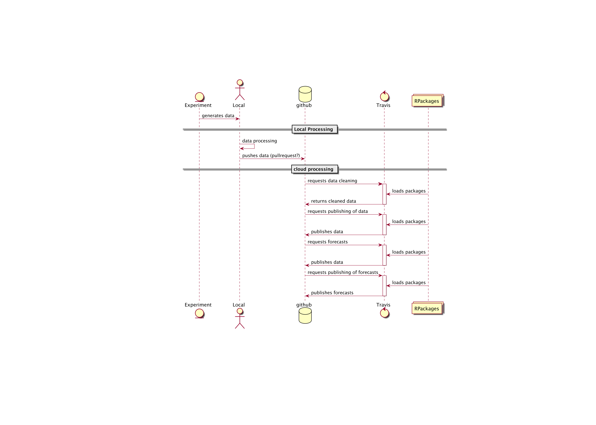
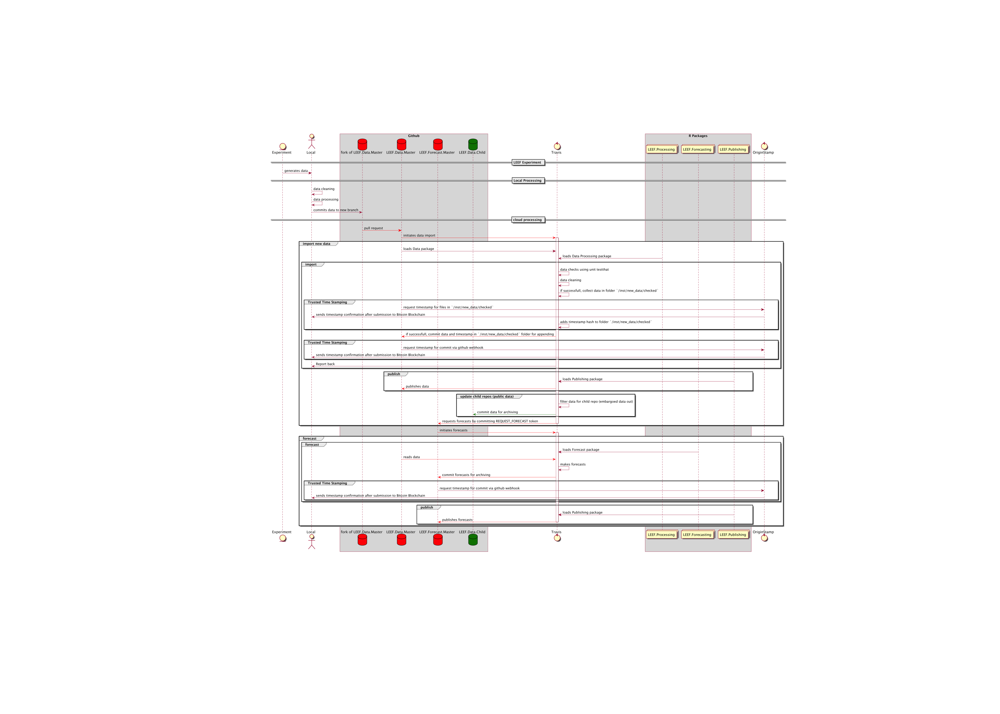
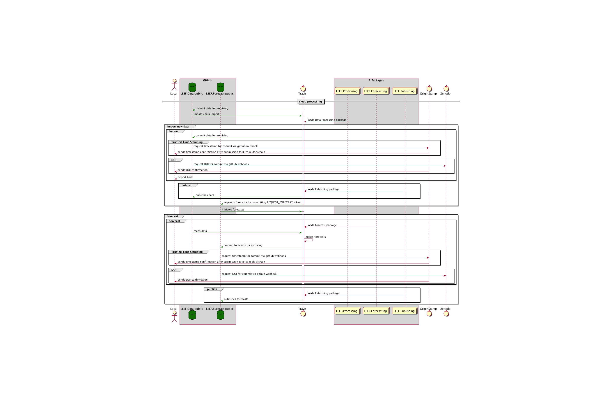
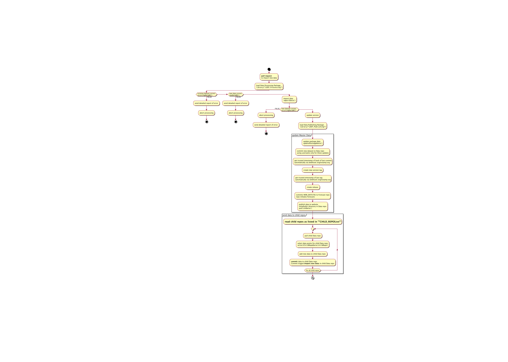
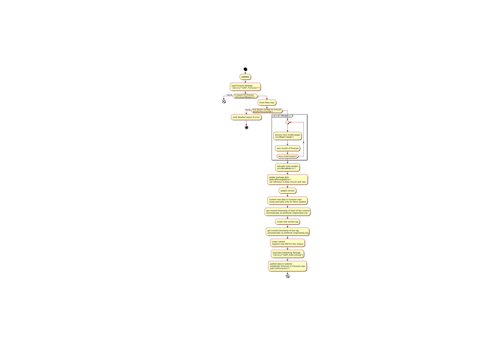
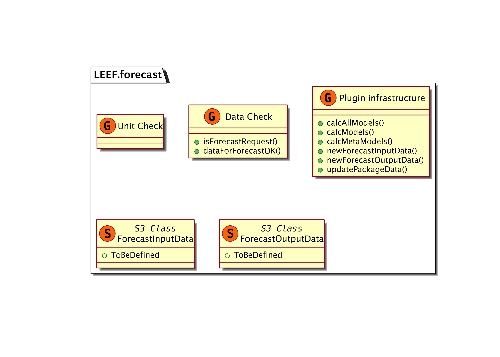
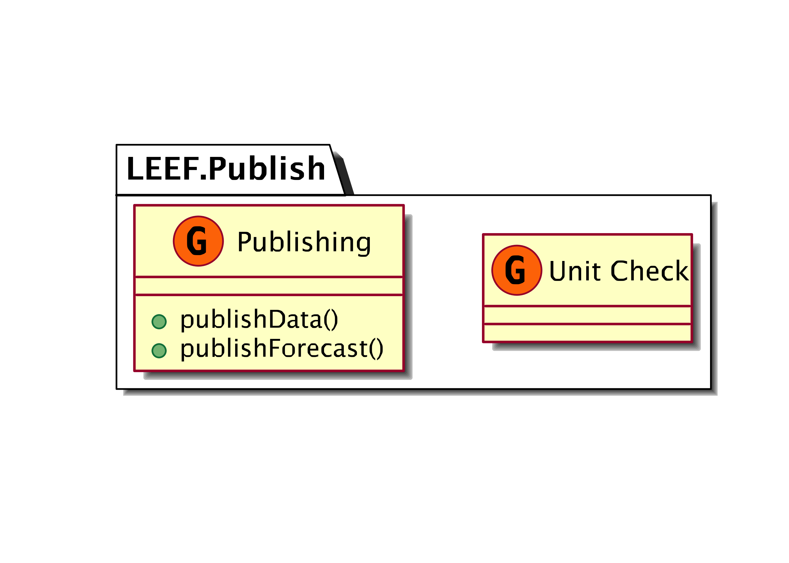

LEEF CA planning
================

<!-- README.md is generated from README.Rmd. Please edit that file -->

# Ideas

  - The workflow should be separated from the functionality, i.e. R
    package containing functionality, scripts (or other packages) which
    contain the workflow load the functionality package and condtrol the
    analysis.

  - the forecast should be triggered automatically after the data has
    been updated, thus the forecasts are perfectly in sync with the
    data. The Forecast repo will contain a link to the tag of the data
    used for the last release. it would be ideal to have the same tags
    for Data release and Forecast release.

## Data storage backend

The implementation of the framework should be agnostic to the database
backend where the actual data is stored. Provessing will be done usinf
dplyr and dbplyr.

This from
<https://rviews.rstudio.com/2017/09/20/dashboards-with-r-and-databases/>
gives an impression on what can be done:

-----

> This code snippet is an example YAML file that config is able to read.
> It has one driver name for local development, and a different name for
> use during deployment:

``` r
default:
  mssql:
      Driver: "SQL Server"
      Server: "[server's path]"
      Database: "[database name]"
      UID: "[user id]"
      PWD: "[pasword]"
      Port: 1433
rsconnect:
  mssql:
      Driver: "SQLServer"
      Server: "[server's path]"
      Database: "[database name]"
      UID: "[user id]"
      PWD: "[pasword]"
      Port: 1433
```

> The default setting will be automatically used when development, and
> RStudio Connect will use the rsconnect values when executing this
> code:

``` r
dw <- config::get("mssql")
con <- DBI::dbConnect(odbc::odbc(),
                      Driver = dw$Driver,
                      Server = dw$Server,
                      UID    = dw$UID,
                      PWD    = dw$PWD,
                      Port   = dw$Port,
                      Database = dw$Database)
```

-----

I am investigating if I can also use csv files as a backend which I
hope, as otherwise it needs to be considered adding an sqlite database
to the github repo.

Smaller databases couyld be located on github (as csv or sqlite
databases) and larger ones can be hosted on external database servers.
The connection parameters are stored in a config file and define the
backend. Therefore, later migration would not be a problem as simply the
data needs to migrated and the new location needs to be specified in the
config file.

## DOI archiving via Zenodo **<span style="color:red">TODO</span>**

DOIs will be automatically created through github and the creation of a
release. See <https://zenodo.org/account/settings/github/> and
<https://help.github.com/articles/creating-releases/>

## Trusted Timestamps **<span style="color:green">IN PROGRESS</span>**

Trusted Timestamps are automatically created using
<https://originstamp.org>. They are automatically created by using a
webhook which is triggered by most events. See
<https://originstamp.org/dev> and particularly
<https://originstamp.org/dev/git> for how to set it up. The email
address used at the moment is
<rainer@krugs.de>.

<https://www.gipp.com/wp-content/papercite-data/pdf/gipp15a.pdf>

<https://www.gipp.com/wp-content/papercite-data/pdf/gipp2016a.pdf>

### TimeStamps requested from GitHub or from R? If from R, they could be included in the commit

<https://www.gwern.net/Timestamping> as a way of timestamping individual
files, where the resulting references can be included in the commit, as
well as a very nice background info on how these things work and can be
done
locally.

### **<span style="color:red">TODO save seed with TTS hash for manual verifycation</span>**

## **<span style="color:red">TODO</span>** Docker

All processing should be done in docker container to guarantee
reproducability. This is especially true for the forecast, but it would
be preferable to also do this for the import of the data as this already
contains some processing and data cleaning.

## Data Structure

### Which data sources

This determines how many tables (csv files) will be in the database /
directory and their content.

## Travis Alternatives regarding `docker`

  - <https://drone.io/pricing/> it uses directly docker container.
    Either on own server or subscription
  - one could investigate the caching
    <http://atodorov.org/blog/2017/08/07/faster-travis-ci-tests-with-docker-cache/>
    to make the execution faster
  - <http://rundef.com/fast-travis-ci-docker-build>
    <span style="color:green"> - interesting option to cache the docker
    images</span>

# Local Processing

## Current processing



All file sizes are per sample.

### Flow Cytometry

1.  Machine output `.c6`
2.  R script
    1.  python (anaconda) command for conversion of `.c6` to `.fca`.
    2.  `BioBase` package reads `.fca` into R, and
    3.  further processing and gating by using `flowCore`
    4.  results in `.csv` with count of particles of gated dataset

#### File Size

  - **raw data (`.c6`):** \(100 \dots 200MB\)
  - **final data (`.csv`):** \(1 \dots 2MB\)

#### **<span style="color:red">TODO</span>**

  - convert R script into package
  - is it usefull to archive `.c6` or file or the one converted to
    `.fca`? Large storage space requirements\!\!\!\!

### Flow CAM

1.  input of reference images for identification
2.  automated classification of particles using reference images
3.  output `.csv` with count of each species

#### File Size

  - **raw data (`.IMAGE`):** a lot
  - **final data (`.csv`):** \(<1MB\)

#### **<span style="color:red">TODO</span>**

  - The image classification of the particles into species is done by
    the Flow CAM. Would it be usefull to do the classifiaction
    externally (reproducability?)? In this case, the same algorythms as
    for the Bemovi particle identification could be used.

### Video / BeMovie

1.  input of reference images for identification
2.  video recording (**~500MB**)
3.  Video analysis using `Bemovi` R package
4.  classification of particles into species
5.  results in `.csv` file with size info for each individual particle
    identified
6.  can be aggregated to return only mean sizes, but not ideal as
    aggregated

#### File Size

  - **raw data (`.VIDEO`):** \(500MB\)
  - **final data (`.csv`):** \(<1MB\)

#### **<span style="color:red">TODO</span>**

  - testig quality of recording. The testing of the movie should be done
    in Bemovi itself (add to package possibly?)
    1.  processing of first seconds of the video
    2.  automatic recognition of errors / quality
    3.  assign quality value (\(1 \dots 0\))
    4.  depending on threshold continue processing, request
        re-recording, or ask for confirmation from operator
  - analyse whole movie

### Manual Count

1.  count individuals
2.  `.csv` file with count of individuals in each species and dilution

#### File Size

  - **raw data (`.xls`):** \(<1MB\)
  - **final data (`.csv`):** \(<1MB\)

#### **<span style="color:red">TODO</span>**

  - design excel form (or similar) to make data entry safer and include
    initial checks

#### Processing to be done

### Respirometer and Temperture

1.  results in `.csv` file with info on \(O_2\) and temperature

#### File Size

  - **raw data (`.csv`):** \(<1MB\)
  - **final data (`.csv`):** \(<1MB\)

#### **<span style="color:red">TODO</span>**

  - nothing I am aware of

### Total Organic Carbon

Need info from Yves.

#### File Size

  - **raw data (`.csv`):** \(<1MB\)
  - **final data (`.csv`):** \(<1MB\)

#### **<span style="color:red">TODO</span>**

### Temperature Incubator Log

1.  continuouslog file - format?

#### File Size

  - **raw data (`.???`):** \(???\)
  - **final data (`.csv`):** \(???\)

#### **<span style="color:red">TODO</span>**

  - nothing I am aware
of

# Sequence Diagrams

## Overview



## Master Repos



## Child Repos (public)



### Remarks

#### DOI and TrustedTimeStamp

These need to be enabled in the repo itself via webhooks. Alternatively,
one could also call them from R via a `curl` command - advantages would
be more control?

#### config file in repo which specifies properties

Format has to be human readable, YAML and one can use the package
`config` <https://cran.r-project.org/web/packages/config/> to load the
configs easily. Also, one can specify the configuration for Master as
well as Child repo in one config file which can be in all repos of the
set.

Possible fields (with default valuse) could be (if one is using R
instead of webhooks for DOI and TTS):

``` r
default:
  doi: FALSE
  tts: TRUE
  data:
    backend: 
    
master:
  doi: FALSE
  tts: TRUE
  data:
    backend:
      mssql:
        Database: "[database name]"
        UID: "[user id]"
        PWD: "[pasword]"
        Port: 1433
        
public:
  doi: TRUE
  tts: TRUE
  data:
    backend:
      csv:
        folder: rawData 

heatwave_e_1:
  doi: TRUE
  tts: TRUE
  data:
    backend:
      csv:
        folder: rawData 
  
heatwave:
  doi: FALSE
  tts: TRUE
  data:
    backend:
      mysql:
        Database: "[database name]"
        UID: "[user id]"
        PWD: "[pasword]"
```

In addition, the repo will contain one file named CONFIG\_NAME which
contains the name of the config to be used, e.g. `master` if it is the
nmaster config

### Questions

  - How to deal with embargoed data - date for end embargo?
      - **Problem**: What if embargo date changes? SHould we change
        already older data? I don’t like this.
      - **Better**: column for embargo id, where each id will be
        specified in meta data table, in which the final date for
        embargo is stored. So the actual data does not need to be
        changed later if the embargo needs to be extended, only the
        embargo table needs to be changed
  - mor than one level of child repos necessary? I don’t think so.

#### Data table

| data | child repo key     |
| ---- | ------------------ |
| …    | public\_MSC\_Peter |
| …    | public\_PhD\_Mary  |
| …    | heatwave\_private  |
| …    | heatwave           |

Do we need multiple child repos? Should be easy to implement and adds
flexibility.

#### Child Repo Table

If there are not to may, a YAML config file could be used, otherwise a
table. The YAML file would be easier to edit. \#\#\#\#\#
Table

| child repo key     | child repo                | from       | until      |
| ------------------ | ------------------------- | ---------- | ---------- |
| public\_MSC\_Peter | LEEF.Data.public          | 12.05.2019 |            |
| public\_PhD\_Mary  | LEEF.Data.public          | 12.05.2022 |            |
| heatwave\_e\_1     | LEEF.Data.heatwave.public | 01.01.2019 | 01.01.2019 |
| heatwave\_private  | LEEF.Data.heatwave        | 01.01.2018 | 01.01.2020 |

##### YAML file

``` r
public_MSC_Peter:
    from:  12.05.2019
    until:
    repo: LEEF.Data.public
public_PhD_Mary:
    from:  12.05.2022`
    until:
    repo: LEEF.Data.public
heatwave_e_1:
    from:  01.01.2019
    until: 01.03.2019
    repo: LEEF.Data.heatwave.public
heatwave_private:
    from:  01.01.2018
    until: 01.01.2020
    repo: LEEF.Data.heatwave
```

# Activity Diagrams

## Import new data



### Check existing data (`existingDataOK()`)

### Check new data (`newDataOK()`

### Import Data (`importData()`

### Publish Data (`publishData()`)

## Forecast



# Component Diagrams

# Github Repos

Github repos are used to archive the data and the forecasts. They also
host the R packege which containe the functionality, but here I will
focus on the Data github repos.

## Private

We need some private repos, as some data will be embargoed for some time
due to thesis and publication priorities.

### LEEF

Repo comntaining this document and all information about the other repos
and links.

#### GitHub apps

  - Trusted Timestamp for all transactions

### LEEF.Data.Master

This repo is used for archiving all data. It will contain the checked
and cleaned data. Functions from the Publishing R package can be used to
calculate summary stats and show these on a website.

The repo is structured as an R package which contains all the data. In
addition, the data is stored in a csv format in the `rawData` folder for
access from other programs. The easiest way to get the updated data is
to update the package in R.

#### GitHub apps

This repo, when receiving a pull request, triggers a Travis-ci build to
- check the data contained in the pull request - clean the data
contained in the pull request - update the data in the repo if the data
is OK and cleaned successfully via a commit as new version. - Trusted
Timestamp for all transactions - publishibng of public data to public
repo - after updating, forecasting is triggered

### Forecasts Archiving

  - get updated data from Archive
  - calculate forecasts
  - archive forecasts as new version
  - publishibng of forecasts based on public data to public repo
  - Get DOI?

#### GitHub apps

  - Travis-ci to do the forecasts and update the repo afterwards

## Public

### Data Archiving

#### GitHub apps

### Forecasts Archiving

#### GitHub apps

# Database Modelling **<span style="color:red">TODO</span>**

Layout Based on
<https://gist.github.com/QuantumGhost/0955a45383a0b6c0bc24f9654b3cb561>

# R Packages

## Data

## Data Check and Cleaning

See the LEEF.Processing package

## Forecast

  - Interface for models needs to be defined
      - data structure (S3 methods) for input and putput data
  - models in separate packages preferable



## Publish



# Background info

  - Commits have to be signed and contain a trusted timestamp, e.g.
      - <https://proofofexistence.com/>
      - <https://tsa.safecreative.org/>
      - <https://www.freetsa.org/index_en.php>
      - this one looks promising:
        <https://www.npmjs.com/package/gitlock>
      - Some background to Trusted Timestamps
        <https://d-mueller.de/blog/dealing-with-trusted-timestamps-in-php-rfc-3161/>
      - bitcoin blockchain
        <https://www.ideals.illinois.edu/bitstream/handle/2142/73770/478_ready.pdf>
      - <https://github.com/cgwalters/git-evtag> ?
