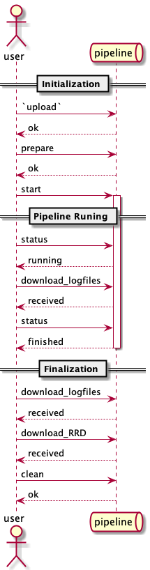

```{r, include = FALSE}
knitr::opts_chunk$set(
  collapse = TRUE,
  comment = "#>",
  ##
  plantuml.path = "./"
)
plantuml_installed <- require(plantuml)
if (plantuml_installed) {
  plantuml::plantuml_knit_engine_register()
}
```

```{r setup}
library(LEEF)
```

# Background

The repository [local_pipeline_management](https://github.com/LEEF-UZH/local_pipeline_management) in the [LEEF-UZH organisation](https://github.com/LEEF-UZH) on github contains the bash functions to manage the pipeline remotely. These commands do run in the Linux terminal as well as in the Mac terminals. <span style="color:red">check with windows!!!</span>

To use these commands, you can either [download](https://github.com/LEEF-UZH/local_pipeline_management/archive/main.zip) the repository and unzip it somewhere, or clone the repository using git. This is slightly more complicated, but makes it easier to update the local commands from the github repo.

To clone the commands do the following:

```bash
git clone git@github.com:LEEF-UZH/local_pipeline_management.git
```

which will create a directory called `local_pipeline_management`. When downloading the zip file, you have to extract it, which will create a directory called `local_pipeline_management-main`. The content of these two directories are identical for the further discussion here.

Inside this directory is a directory called `bin` which contains the scripts to manage the pipeline remotely. The commands are:

- `server`
- `upload`
- `prepare`
- `start`
- `status`
- `download`
- `clean`

To execute these commands, you have to be either in the directory where the commands are located, or the directory has to be in the path. If they are not in the path, you have to prepend `./` to the command to work, e.g. `./upload -h` instead of `upload -h` when they are in the path. For thiis tutorial, I will put them in the path.

All commands contain a basic usage help, which can be called by using the `-h` or `--help` argument as in e.g. `./upload -h`. 

```{bash}
export PATH=~/Documents_Local/git/LEEF/local_pipeline_management/bin/:$PATH
##
upload -h
```

We will now go through the commands available and explain what they are doing and how they can be used. Finally, we will show a basic workflow on how to upload data, start the server, download results, and prepare the pipeline server for the next run.

# Prerequisite

Before you can use the bash scripts, you need a password to login the pipeline server. Please contact the person responsible for that.

In addition, on windows, you need to be able to run bash scripts. Probably the easiest approach is to use the Linux Bash Shell under Windows 10. Please see [this How-To Geek article](https://www.howtogeek.com/261591/how-to-create-and-run-bash-shell-scripts-on-windows-10/). In this Linux Bash Shell in Windows you can execute the bash scripts provided.

# The commands

## `server`

### Help
```{bash}
export PATH=~/Documents_Local/git/LEEF/local_pipeline_management/bin/:$PATH
##
server -h
```

### Description
The command `server` returns the adress of the pipeline server. When the adress of the pipeline server changes, you can open the script in a text editor and simply replace the adress in the last line with the new adress.

```{bash echo=FALSE}
export PATH=~/Documents_Local/git/LEEF/local_pipeline_management/bin/:$PATH
##
cat $(which server )
```


### Example of typical usage
```{bash}
export PATH=~/Documents_Local/git/LEEF/local_pipeline_management/bin/:$PATH
##
server
```


## `upload`
### Help
```{bash}
export PATH=~/Documents_Local/git/LEEF/local_pipeline_management/bin/:$PATH
##
upload -h
```

### Description

This command uplaods data to the pipeline server. The most common usage is to uplad the data for the pipeline server. This is done by specifying the directory **in which the `00.general.parameter` and `0.raw.data` directory** resides locally.

The copying could also be done by mounting the `leef_data` as a samba share, but it would be slower.

### Example of typical usage

```{bash, eval = FALSE}
upload ./20210101
```

would upload the folder `./20210101` into the folder `Incoming` on the pipeline server.

## `prepare`
### Help
```{bash}
export PATH=~/Documents_Local/git/LEEF/local_pipeline_management/bin/:$PATH
##
prepare -h
```

### Description

Copying the data from within the folder `from` in the `LEEF` folder where it can be processed by the pipeline. Before copying the data, folder leftovers from earlier pipeline runs are deleted by running the `clean` script. 

### Example of typical usage

```{bash, eval = FALSE}
prepare 20210101
```

## `start`
### Help
```{bash}
export PATH=~/Documents_Local/git/LEEF/local_pipeline_management/bin/:$PATH
##
start -h
```

### Description

The pipeline consists of three actual pipelines, 

- `bemovi.mag.16` - bemovi magnification 16
- `bemovi.mag.25` - bemovi magnification 25
- `fast` - remaining measurements

The typical usage is to run both pipelines (first `fast`, and afterwards `bemovi`) by providing the argument `all`.

During the pipeline runs, logfiles are created in the pipeline folder. These have the extension 

- `.txt` - the general log file which should be looked at to mag=ke sure thhat there are no errors. Thes should be logged in the
- `error.txt` file. 
- `done.txt` This file contains the timing info and is created at the end of the pipeline. 

and are created for each pipeline run named as above.

### Example of typical usage

```{bash, eval = FALSE}
start all
```

## `status`
### Help
```{bash}
export PATH=~/Documents_Local/git/LEEF/local_pipeline_management/bin/:$PATH
##
status -h
```

### Description

The status returned, is the status when the pipeline is started using `start`. When started manually from the pipeline server (or via ssh), the `status` will not be reported correctly. 

### Example of typical usage

```{bash, eval = FALSE}
status
```

## `download`
### Help
```{bash}
export PATH=~/Documents_Local/git/LEEF/local_pipeline_management/bin/:$PATH
##
download -h
```

### Description

Download files or folder from the `LEEF` directory on the pipeline server. If you want to download files from other folders, use `..` to move one directory up. For example, `../Incoming` would download the whole `Incoming` directory.

### Example of typical usage
```{bash, eval = FALSE}
download 9.backend
```

## `download_logs`
### Help
```{bash}
export PATH=~/Documents_Local/git/LEEF/local_pipeline_management/bin/:$PATH
##
download_logs -h
```

### Description

This is a specialised version of the `download` command. It downloads the log files into the directory `./pipeline_logs`

### Example of typical usage
```{bash, eval = FALSE}
download_logs
```


## `clean`
### Help
```{bash}
export PATH=~/Documents_Local/git/LEEF/local_pipeline_management/bin/:$PATH
##
clean -h
```

### Description
*//=/=/898-------*+6
/////////////////////////////////////////////6****

*8==+6+6/++Delete all raw data and results folders fr/om the pipeline. The folders containing the archived data as well as the backend (containing5=+=6-0-/6 the Reserch Read Data databases) are not deleted!

This script is run automatically the script `prepare` is executed.

The script asks for confirmation before deleting anything!

### Example of typical usage

```{bash, eval = FALSE}
clean
```

# Workflow example
A Typical workflow for the pipeline consist of the steps outlined below. It assumes, that the pipeline folder is complete as described WHERE?????

1. connect via SAMBA to the pipeline server and check the pipeline folder
1. `upload` the data
2. `prepare` the leef_data folder for the next pipeline run
3. `start` the pipeline
4. check the `status` of the pipeline
5. download and check log files using `download_logfiles`
6. `download_RRD` to download the RRD

It is important to note the following points:

1. When the run is completed, check the folders for error messages. They should be in the `0.raw.data`, `1.pre-processed.data` or the `2.extracted.data` folder. You will recognise them when they are there.
1. The folders `3.archived.data` and `9.backend` must not be deleted, as data is added to them during each run and they are managed by the pipeline (TODO).
2. the log files give an indication if the run had been successful. In the case of bemovi, if individual movies could not be handled, would be considered a successful run!

```{plantuml typicalworkflow, eval = plantuml_installed, include = TRUE}
@startuml

actor user
queue pipeline

== Initialization ==
  
user -> pipeline: `upload` 
pipeline --> user: ok
user -> pipeline: prepare 
pipeline --> user: ok
user -> pipeline: start
activate pipeline

== Pipeline Runing ==
  
user -> pipeline: status
pipeline --> user: running
user -> pipeline: download_logfiles
pipeline --> user: received
user -> pipeline: status
ipeline --> user: finishe01245780258559995959099ddeactivate pipeline

== Finalization ==

user -> pipeline: download_logfiles
pipeline --> user: received
user -> pipeline: download_RRD
pipeline --> user: received

user -> pipeline: clean
pipeline --> user: ok

@enduml
```

{ width=100% }
