```{r, include = FALSE}
knitr::opts_chunk$set(
  collapse = TRUE,
  comment = "#>",
  echo = FALSE,
  eval = TRUE,
  fig.retina = 4,
  ##
  plantuml.path = "./"
)
library(LEEF)
plantuml_installed <- require(plantuml)
if (plantuml_installed) {
  plantuml::plantuml_knit_engine_register()
}
```

# **Important**

**<span style="color:red">
The whole document needs to be re-worked and does not reflect the current design!
It is based on the initial planning and has not been updated.

It does not reflect the actual package and day=tabase!!!!

TODO: Update this document!
</span>**

# Ideas
- The workflow should be separated from the functionality, i.e. R package containing functionality, scripts (or other packages) which contain the workflow load the functionality package and condtrol the analysis.

- the forecast should be triggered automatically after the data has been updated, thus the forecasts are perfectly in sync with the data. The Forecast repo will contain a link to the tag of the data used for the last release. it would be ideal to have the same tags for Data release and Forecast release.


##  Trusted Timestamps **<span style="color:green">IN PROGRESS</span>**
Trusted Timestamps will be automatically created using the `ROriginStamp` package when data is archived.


# Local Processing
## Current processing

```{plantuml localProcessingCurrent, eval = plantuml_installed, include = FALSE}
start
:take samples;
fork
  :Flow Cytometry
  //every second day//;
  :"".c6"" file;
  :R script
  # convert "".c6"" to "".fsa"" using python
  # read "".fsa"" and gates data
  # saves as "".csv"";
fork again
  :Flow CAM
  //every second day//;
  :# images of each particle
  # identification of species using reference image selection
  **This is done internally in a black box**;
  :output of "".csv"" file containi g count of species;
fork again
  :Video / Bemovi
  //every second day//;
  :Video recording;
  :Video Analysis using Bemovi R package
  # classification of identified particles
  #export of each individual (species and size) into "".csv"" file;
fork again
  :Manual Count
  // every second day//;
  :Count of each species;
  :Entering into "".xls"" form incl. data checks;
  :export "".csv"" file;
fork again
  :Respirometer / Tepmperature
  //every second day//;
  :Download of "".csv"" file;
fork again
  :Total Organic Carbon
  //every second day//;
  :Local Processing ?;
  :"".csv"" file for further processing;
fork again
  :Temperature Incubator Log
  //continuous and automatic//;
  :Local Processing ?;
  :"".csv"" file for further processing;
end fork
:create new branch on Data Repo Fork;
:commit new data;
:push to github;
:issue pull request to Data Repo;
```

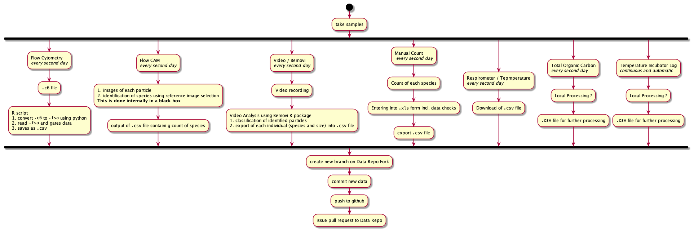{ width=100% }

All file sizes are per sample.

### Flow Cytometry 

1. Machine output `.c6`
2. R script 
    2. `BioBase` package reads `.fca` into R, and 
    3. further processing and gating by using `flowCore`
    4. results in `.csv` with count of particles of gated dataset

#### File Size
- **raw data (`.c6`):** $100 \dots 200MB$
- **final data (`.csv`):**  $1 \dots 2MB$

#### **<span style="color:red">TODO</span>** 
- convert R script into package
- is it usefull to archive `.c6` or file or the one converted to `.fca`? Large storage space requirements!!!!


### Flow CAM  
1. input of reference images for identification
2. automated classification of particles using reference images
3. output `.csv` with count of each species


#### File Size
- **raw data (`.IMAGE`):** a lot
- **final data (`.csv`):**  $<1MB$

#### **<span style="color:red">TODO</span>**
- The image classification of the particles into species is done by the Flow CAM. Would it be usefull to do the classifiaction externally (reproducability?)? In this case, the same algorythms as for the Bemovi particle identification could be used.

### Video / BeMovie  
1. input of reference images for identification
1. video recording (**~500MB**)
2. Video analysis using `Bemovi` R package
3. classification of particles into species
4. results in `.csv` file with size info for each individual particle identified
5. can be aggregated to return only mean sizes, but not ideal as aggregated

#### File Size
- **raw data (`.VIDEO`):** $500MB$
- **final data (`.csv`):**  $<1MB$

#### **<span style="color:red">TODO</span>**
- testig quality of recording. The testing of the movie should be done in Bemovi itself (add to package possibly?)
  1. processing of first seconds of the video
  2. automatic recognition of errors / quality
  3. assign quality value ($1 \dots 0$) 
  4. depending on threshold continue processing, request re-recording, or ask for confirmation from operator
- analyse whole movie

### Manual Count  
1. count individuals
2. `.csv` file with count of individuals in each species and dilution 

#### File Size
- **raw data (`.xls`):** $<1MB$
- **final data (`.csv`):**  $<1MB$

#### **<span style="color:red">TODO</span>**
- design excel form (or similar) to make data entry safer and include initial checks

#### Processing to be done

### Respirometer and Temperture  
1. results in `.csv` file with info on $O_2$ and temperature

#### File Size
- **raw data (`.csv`):** $<1MB$
- **final data (`.csv`):**  $<1MB$

#### **<span style="color:red">TODO</span>**
- nothing I am aware of

### Total Organic Carbon  
Need info from Yves.

#### File Size

- **raw data (`.csv`):** $<1MB$
- **final data (`.csv`):**  $<1MB$

#### **<span style="color:red">TODO</span>**


# Sequence Diagrams
## Overview
```{plantuml seq_overview, eval = plantuml_installed, include = FALSE}
entity Experiment as exp
actor Local as lpr
database github as ghb
control Travis as trv
collections RPackages as rpk

exp -> lpr : generates data
== Local Processing ==
lpr -> lpr : data processing
lpr -> ghb : pushes data (pullrequest?)
== cloud processing ==
ghb -> trv : requests data cleaning
activate trv
trv <- rpk : loads packages
trv -> ghb : returns cleaned data
deactivate trv
ghb -> trv : requests publishing of data
activate trv
trv <- rpk : loads packages
trv -> ghb : publishes data
deactivate trv
ghb -> trv : requests forecasts
activate trv
trv <- rpk : loads packages
trv -> ghb : publishes data
deactivate trv
ghb -> trv : requests publishing of forecasts
activate trv
trv <- rpk : loads packages
trv -> ghb : publishes forecasts
deactivate trv
```
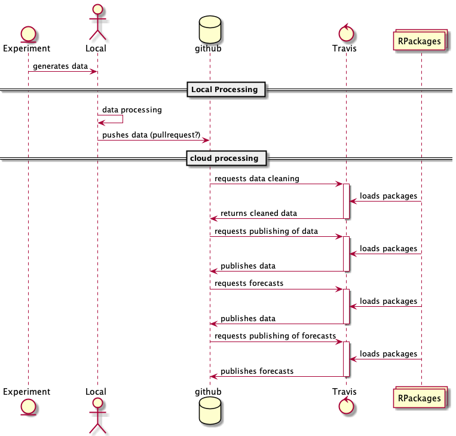{ width=100% }


## Master Repos
```{plantuml sequence_detailed_main_repo, eval = plantuml_installed, include = FALSE}
entity Experiment as exp
actor Local as lpr
box "Github"
  database "fork of LEEF.Master" as ghbr #red
  database "LEEF.Master" as ghbd #red
  database "LEEF.Forecast.Master" as ghbf #red
  database "LEEF.Child" as ghbdp #green
end box
control Travis as trv
box "R Packages"
  collections LEEF.Processing as rdc
  collections LEEF.Forecasting as rfc
  collections LEEF.Publishing as rpb
end box

control OriginStamp as os

== LEEF Experiment ==

exp -> lpr : generates data

== Local Processing ==

lpr -> lpr : data cleaning
lpr -> lpr : data processing
lpr -> ghbr : commits data to new branch

== cloud processing ==
ghbr -[#red]> ghbd : pull request

ghbd -[#red]> trv : initiates data import
activate trv
group import new data
  trv <- ghbd : loads Data package
  trv <- rdc : loads Data Processing package
  group import
      trv -> trv : data checks using unit testthat
      trv -> trv : data cleaning
      trv -> trv : if successfull, collect data in folder `/inst/new_data/checked`
      group Trusted Time Stamping
        ghbd -> os : request timestamp for files in `/inst/new_data/checked` 
        os -> lpr : sends timestamp confirmation after submission to Bitcoin Blockchain
        trv -> trv : adds timestamp hash to folder `/inst/new_data/checked`
      end
      trv -[#red]> ghbd : if successfull, commit data and timestamp in `/inst/new_data/checked` folder for appending
      group Trusted Time Stamping
        ghbd -> os : request timestamp for commit via github webhook
        os -> lpr : sends timestamp confirmation after submission to Bitcoin Blockchain
      end
      trv -> lpr : Report back
  end

  group publish
      trv <- rpb : loads Publishing package
      trv -[#red]> ghbd : publishes data
  end

  group update child repos (public data)
    trv -> trv : filter data for child repo (embargoed data out)
    trv -[#green]> ghbdp : commit data for archiving
  end
  trv -[#red]> ghbf : requests forecasts by committing REQUEST_FORECAST token
  deactivate trv
end

ghbf -[#red]> trv : initiates forecasts
activate trv
group forecast
  group forecast
      trv <- rfc : loads Forecast package
      ghbd -[#red]> trv : reads data
      trv -> trv : makes forecasts
      trv -[#red]> ghbf : commit forecasts for archiving
      group Trusted Time Stamping
        ghbf -> os : request timestamp for commit via github webhook
        os -> lpr : sends timestamp confirmation after submission to Bitcoin Blockchain
      end

  end

  group publish
      trv <- rpb : loads Publishing package
      trv -[#red]> ghbf : publishes forecasts
    deactivate trv
  end
end
```

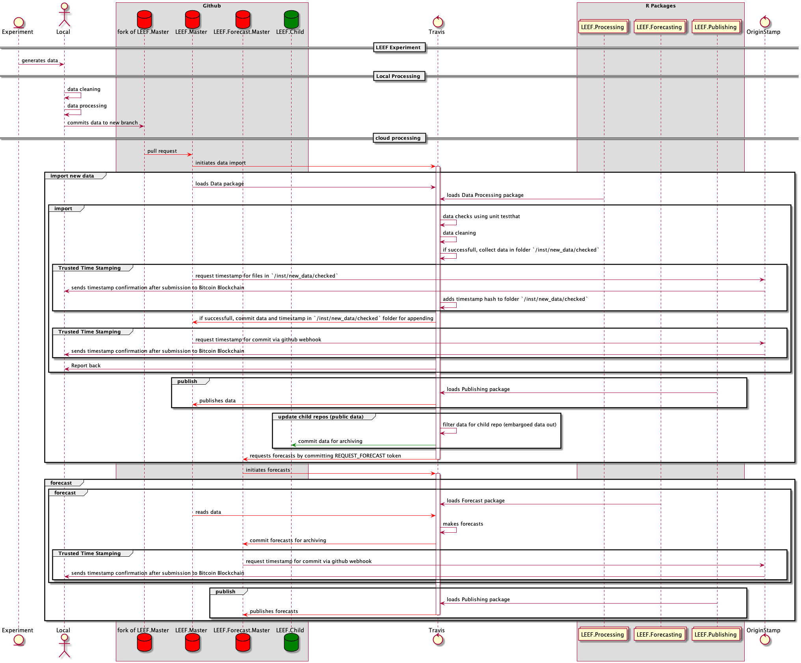{ width=100% }


## Child Repos (public)
```{plantuml sequence_detailed_child_repo, eval = plantuml_installed, include = FALSE}
actor Local as lpr

box "Github"
  database "LEEF.public" as ghbdp #green
  database "LEEF.Forecast.public" as ghbfp #green
end box
control Travis as trv
box "R Packages"
  collections LEEF.Processing as rdc
  collections LEEF.Forecasting as rfc
  collections LEEF.Publishing as rpb
end box

control OriginStamp as os
control Zenodo as doi

== cloud processing ==
activate trv
    trv -[#green]> ghbdp : commit data for archiving
deactivate trv


ghbdp -[#green]> trv : initiates data import
activate trv
trv <- rdc : loads Data Processing package
group import new data
  group import
      trv -[#green]> ghbdp : commit data for archiving
      group Trusted Time Stamping
        ghbdp -> os : request timestamp for commit via github webhook
        os -> lpr : sends timestamp confirmation after submission to Bitcoin Blockchain
      end
      group DOI
        ghbdp -> doi : request DOI for commit via github webhook
        os -> lpr : sends DOI confirmation
      end
      trv -> lpr : Report back
  end

  group publish
      trv <- rpb : loads Publishing package
      trv -[#green]> ghbdp : publishes data
  end

  trv -[#green]> ghbfp : requests forecasts by committing REQUEST_FORECAST token
  deactivate trv
end

ghbfp -[#green]> trv : initiates forecasts
activate trv
group forecast
  group forecast
      trv <- rfc : loads Forecast package
      ghbdp -[#green]> trv : reads data
      trv -> trv : makes forecasts
      trv -[#green]> ghbfp : commit forecasts for archiving
      group Trusted Time Stamping
        ghbfp -> os : request timestamp for commit via github webhook
        os -> lpr : sends timestamp confirmation after submission to Bitcoin Blockchain
      end
      group DOI
        ghbfp -> doi : request DOI for commit via github webhook
        os -> lpr : sends DOI confirmation
      end
  end

  group publish
      trv <- rpb : loads Publishing package
      trv -[#green]> ghbfp : publishes forecasts
    deactivate trv
  end
end
```

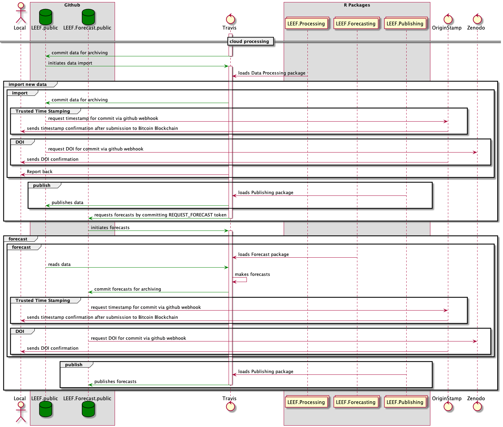{ width=100% }

### Remarks
#### DOI and TrustedTimeStamp
These need to be enabled in the repo itself via webhooks. Alternatively, one could also call them from R via a `curl` command - advantages would be more control?


#### config file in repo which specifies properties
Format has to be human readable, YAML and one can use the package `config` https://cran.r-project.org/web/packages/config/ to load the configs easily. Also, one can specify the configuration for Master as well as Child repo in one config file which can be in all repos of the set.

Possible fields (with default valuse) could be (if one is using R instead of webhooks for DOI and TTS):

```{R, echo = TRUE, eval = FALSE}
default:
  doi: FALSE
  tts: TRUE
  data:
    backend: 
    
master:
  doi: FALSE
  tts: TRUE
  data:
    backend:
      mssql:
        Database: "[database name]"
        UID: "[user id]"
        PWD: "[pasword]"
        Port: 1433
        
public:
  doi: TRUE
  tts: TRUE
  data:
    backend:
      csv:
        folder: rawData 

heatwave_e_1:
  doi: TRUE
  tts: TRUE
  data:
    backend:
      csv:
        folder: rawData 
  
heatwave:
  doi: FALSE
  tts: TRUE
  data:
    backend:
      mysql:
        Database: "[database name]"
        UID: "[user id]"
        PWD: "[pasword]"
```

In addition, the repo will contain one file named CONFIG_NAME which contains the name of the config to be used, e.g. `master` if it is the nmaster config

### Questions
- How to deal with embargoed data - date for end embargo? 
    - **Problem**: What if embargo date changes? SHould we change already older data? I don't like this.
    - **Better**: column for embargo id, where each id will be specified in meta data table, in which the final date for embargo is stored. So the actual data does not need to be changed later if the embargo needs to be extended, only the embargo table needs to be changed
- mor than one level of child repos necessary? I don't think so.
   

#### Data table
 data  | child repo key    |
------ | --------------- |
 ...   | public_MSC_Peter |
 ...   | public_PhD_Mary |
 ...   | heatwave_private |
 ...   | heatwave |
 
Do we need multiple child repos? Should be easy to implement and adds flexibility.

#### Child Repo Table
If there are not to may, a YAML config file could be used, otherwise a table. The YAML file would be easier to edit.
##### Table

child repo key | child repo              | from        | until      |
--- | --- | --- | --- |
public_MSC_Peter | LEEF.public      | 12.05.2019  |            |
public_PhD_Mary | LEEF.public       | 12.05.2022  |            |
heatwave_e_1 | LEEF.heatwave.public | 01.01.2019  | 01.01.2019 |
heatwave_private | LEEF.heatwave    | 01.01.2018  | 01.01.2020 |
    
##### YAML file
```{r echo = TRUE, eval = FALSE}
public_MSC_Peter:
    from:  12.05.2019
    until:
    repo: LEEF.public
public_PhD_Mary:
    from:  12.05.2022`
    until:
    repo: LEEF.public
heatwave_e_1:
    from:  01.01.2019
    until: 01.03.2019
    repo: LEEF.heatwave.public
heatwave_private:
    from:  01.01.2018
    until: 01.01.2020
    repo: LEEF.heatwave
```

# Activity Diagrams

## Import new data
```{plantuml activity_import, eval = plantuml_installed, include = FALSE}
start

:**pull request**
to import new data;

:load Data Processing Package
""library("LEEF.Processing")"";

if (existing dataset correct\n""existingDataOK()"") then (""FALSE"")
  :send detailed report of error;
  :abort processing;
  stop
elseif (new data correct\n""newDataOK()"") then (""FALSE"")
  :send detailed report of error;
  :abort processing;
  stop
else 
  :import data\n""importData()"";

if (new dataset correct\n""existingDataOK()"") then (""FALSE"")
  :abort processing;
  :send detailed report of error;
  stop
else 

  :update version;

  :load Data Publishing Package
  ""library("LEEF.Publishing")"";

  partition "update Master Data" {  
    :update package data
    ""updatePackageData()"";

    :commit new dataset to Data repo
    using username only for these updates;
    :get trusted timestamp of hash of last commit
    automatically via webhook originstamp.org;
    :create new version tag;
    :get trusted timestamp of last tag
    automatically via webhook originstamp.org;
    :create release;
    :commits NEW_DATA file to Forecast repo
    repo initiates forecasts;

    :publish data to website
    initially ""doc"" directory in Data repo
    ""publishData()"";
  }
  partition "send data to child repos" {
    :=read child repos as listed in ""CHILD_REPOS.txt"";
    repeat
      :pull child Data repo;
      :select data points for child Data repo
      ""selectChildRepoData(childRepo)"";
      :add new data to child Data repo;
      :**commit** data to child Data repo
      Commit triggers **Import new Data** in child Data repo;
    repeat while (for all child repos)
  }

  end
```

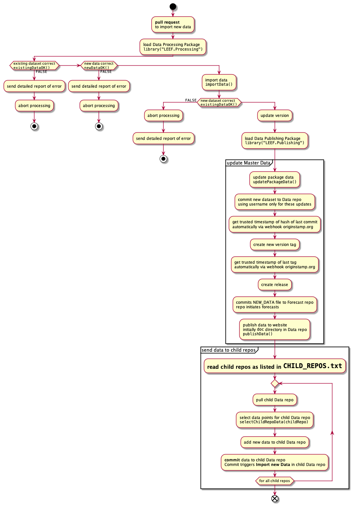{ width=100% }

### Check existing data (`existingDataOK()`)
### Check new data (`newDataOK()`
### Import Data (`importData()`
### Publish Data (`publishData()`)

## Forecast
```{plantuml activity_forecast, eval = plantuml_installed, include = FALSE}
start

:**commit**;

:load Forecast Package
""library("LEEF.Forecast")"";

if (is request for forecast\n""isForecastRequest()"") then (""FALSE"")
  end
else
  :clone Data repo;
  
if (new dataset suitable for forecast\n""dataForForecastOK()"") then (""FALSE"")
  :send detailed report of error;
  stop
else 
  partition """calcAllModels()""" {
    repeat
      :process next model plugin
      ""calcModel(model)"";
      :save results of forecast;
    repeat while (more model plugins?)
  }

  :calculate meta models\n""calcMetaModels()"";

  :update package data
  ""updatePackageData()""
  :set reference to Data version and repo;
  :update version;
  :commit new data to Forecast repo
  using username only for these updates;
  :get trusted timestamp of hash of last commit
  automatically via webhook originstamp.org;
  :create new version tag;
  :get trusted timestamp of last tag
  automatically via webhook originstamp.org;
  :create release
  requests new DOI for this release;
  
  :load Data Publishing Package
  ""library("LEEF.Publishing")"";

  :publish data to website
  initially ""doc"" directory in Forecast repo
  ""publishForecast()"";
  end
```

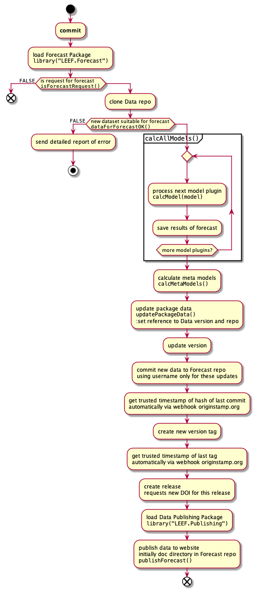{ width=100% }

# Component Diagrams
```{plantuml com_plantuml, eval = plantuml_installed, include = FALSE}
package "LEEF Experiment" {
  [Environmental variables] as ev
  [Microbial Communities Data] as mcd
  ev <..> mcd
}

package "Local" {
  [Data Preparation] as dpl
}

cloud  "Cloud - processing" {

  database "github --- Master" {
    folder "Master" {
      [Data Archiving] as dar
    }

    folder "Public" {
      [Data] as data
      [Forecasts] as for
    }
  }

  database "github --- packages" {
    [LEEF_RawData] as rdp
    [LEEF_Forecast] as rfc
    [LEEF_Publish] as rpb
    }

  database "Travis" {
    [Data Preparation] as dpr
    [Data Pubvlishing] as dpb
  }

ev --> dpl
mcd --> dpl

dpl --> dar : pushed

dar --> dpr : requests data preparation
dpr <-- rdp : loads R package
dpr --> dar : returns data for archiving

dar --> dpr : requests data preparation
dpr <-- rdp : loads R package
dpr --> dar : returns data for archiving

dar --> dpb : requests data preparation
dpb <-- rpb : loads R package
dpb --> data : returns data for archiving
}
```

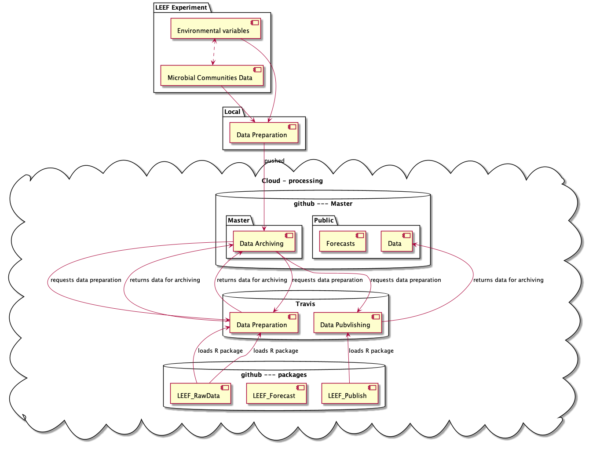{ width=100% }

# Github Repos
Github repos are used to archive the data and the forecasts. They also host the R packege which containe the functionality, but here I will focus on the Data github repos.


## Private
We need some private repos, as some data will be embargoed for some time due to thesis and publication priorities.

### LEEF
Repo comntaining this document and all information about the other repos and links.

#### GitHub apps
- Trusted Timestamp for all transactions

### LEEF.Master
This repo is used for archiving all data. It will contain the checked and cleaned data. Functions from the Publishing R package can be used to calculate summary stats and show these on a website.

The repo is structured as an R package which contains all the data. In addition, the data is stored in a csv format in the `rawData` folder for access from other programs. The easiest way to get the updated data is to update the package in R.


#### GitHub apps
This repo, when receiving a pull request, triggers a Travis-ci build to
- check the data contained in the pull request
- clean the data contained in the pull request
- update the data in the repo if the data is OK and cleaned successfully via a commit as new version.
- Trusted Timestamp for all transactions
- publishibng of public data to public repo
- after updating, forecasting is triggered

### Forecasts Archiving
- get updated data from Archive
- calculate forecasts
- archive forecasts as new version
- publishibng of forecasts based on public data to public repo
- Get DOI?

#### GitHub apps
- Travis-ci to do the forecasts and update the repo afterwards

## Public
### Data Archiving
#### GitHub apps
### Forecasts Archiving
#### GitHub apps

# Database Modelling **<span style="color:red">TODO</span>**
Layout Based on https://gist.github.com/QuantumGhost/0955a45383a0b6c0bc24f9654b3cb561

```{plantuml databaseModell}
skinparam dpi 300
!define Table(name,desc) class name as "desc" << (T,#FFAAAA) >>
' we use bold for primary key
' green color for unique
' and underscore for not_null
!define primary_key(x) <b>x</b>
!define unique(x) <color:green>x</color>
!define not_null(x) <u>x</u>
!define field(x) <color:black>x</color>
' other tags available:
' <i></i>
' <back:COLOR></color>, where color is a color name or html color code
' (#FFAACC)
' see: http://plantuml.com/classes.html#More
hide methods
hide stereotypes

' entities

Table(user, "user (User in our system)") {
primary_key(id) INTEGER
not_null(unique(username)) VARCHAR[32]
not_null(password) VARCHAR[64]
}

Table(session, "session (session for user)") {
primary_key(id) INTEGER
not_null(user_id) INTEGER
not_null(unique(session_id)) VARCHAR[64]
}

Table(user_profile, "user_profile (Some info of user)") {
primary_key(user_id) INTEGER
age SMALLINT
gender SMALLINT
birthday DATETIME
}

Table(group, "group (group of users)") {
primary_key(id) INTEGER
not_null(name) VARCHAR[32]
}

Table(user_group, "user_group (relationship of user and group)") {
primary_key(user_id) INTEGER
primary_key(group_id) INTEGER
joined_at DATETIME
}

' relationships
' one-to-one relationship
user -- user_profile : "A user only has one profile"
' one to may relationship
user --> session : "A user may have many sessions"
' many to many relationship
' Add mark if you like
user "1" --> "*" user_group : "A user may be in many groups"
group "1" --> "0..N" user_group : "A group may contain many users"
```

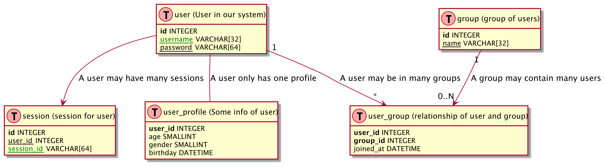{ width=100% }

# R Packages

## Data
## Data Check and Cleaning
See the LEEF.Processing package

## Forecast
- Interface for models needs to be defined
    - data structure (S3 methods) for input and putput data
- models in separate packages preferable


```{plantuml leef.forecast, eval = plantuml_installed, include = FALSE}
package "LEEF.forecast" {
  class "Unit Check" << (G,#FF7700) >> {
  }
  class "Data Check" << (G,#FF7700) >> {
    + isForecastRequest()
    + dataForForecastOK()
  }
  class "Plugin infrastructure" << (G,#FF7700) >> {
    + calcAllModels()
    + calcModels()
    + calcMetaModels()
    + newForecastInputData()
    + newForecastOutputData()
    + updatePackageData()
  }
  class "ForecastInputData" << (S,#FF7700) "S3 Class" >> {
    + ToBeDefined
  }
  class "ForecastOutputData" << (S,#FF7700) "S3 Class" >> {
    + ToBeDefined
  }
}
```

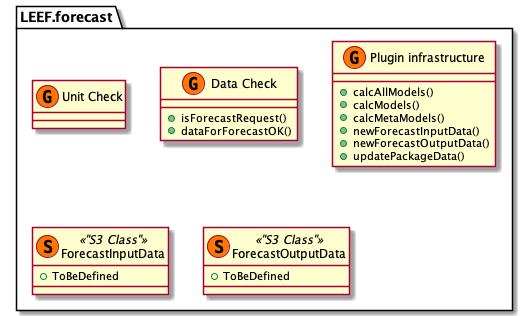{ width=100% }

## Publish
```{plantuml leef.publish, eval = plantuml_installed, include = FALSE}
package "LEEF.Publish" {
  class "Unit Check" << (G,#FF7700) >> {
  }
  class "Publishing" << (G,#FF7700) >> {
    + publishData()
    + publishForecast()
  }
}
```

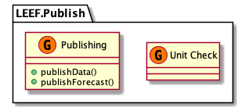{ width=100% }

# Background info
- Commits have to be signed and contain a trusted timestamp, e.g. 
    - https://proofofexistence.com/
    - https://tsa.safecreative.org/
    - https://www.freetsa.org/index_en.php
    - this one looks promising: https://www.npmjs.com/package/gitlock
    - Some background to Trusted Timestamps https://d-mueller.de/blog/dealing-with-trusted-timestamps-in-php-rfc-3161/
    - bitcoin blockchain https://www.ideals.illinois.edu/bitstream/handle/2142/73770/478_ready.pdf
    - https://github.com/cgwalters/git-evtag ?
    
    
    
    
# Part 2 - README2

bftools from https://docs.openmicroscopy.org/bio-formats/5.8.2/users/comlinetools/conversion.html (2018/06/22)

****************

# TODO


## Move `pre-processors` and `extractors` into separate packages
These will contain the functions and the code to add it to the queue for processing.
This adds flexibility as additional data sources can be added easier.

## Documentation and tests need to be revised and completed
* **<span style="color:green">DONE</span>** revise Tests
* revise documentation

## Metadata storage **<span style="color:red">TODO</span>**
Which metadata should be stored and in which format?
Metadata is required at different levels:

1. new data package
  - date, experiment, who collated the data package (responsible for it), comments, ...
  - linked via the hash used for the TTS
2. data source
  - machine, type, version, person who processed the data, comments, ...
3. per experiment
  - name, person responsible, info about experiment, comments, ...
    How to store the description of the experiment - link to paper / outline?
4. I am sure we need more!!!!!!

## Define database structure including hash and id fields
1) define fields and linkages between tables
2) add hash and id fields to `.rds` files in the `LastAdded` folder
3) Write code to write LastAdded to SQLite database

## function to request DOI
This function will publish the data at the is only necessary for public repos, but the functionality needs to be included here. This needs to be done in a github repo - gitlab possible?

## Download seed file
After the TTS is obtained, the seed is downloiaded and saved in the directory as well.
This needs to be automated and done later, as the seed is only avvailable about 24 hours after the initial submission.

## Investigate the possiblility of using the gitlab installation from Mathematics department for the local storage.
This is unlikely using the current structure and hopefully new options will materialise after the Bern meeting.

## Add remote storage instead of SQLite database

****************

# DONE

## Hashing and TTS for new_data **<span style="color:red">TODO</span>**
Request TTS (Trusted Time Stamp) is obtained from `archive_new_data()` and is stored in the samd directory as the archive

## build hash / checksum of  archive
This is used only to checksum the archive and for obtaining the TTS for the archive hash.

## Pre-processing of data
Conversion to open formats for archiving and fuerther procesing

## Extraction of data
Extraction of dat and storage in data.table / tibble for addition to database

## Confirm on what `raw data` is for archiving, DOI, ...
At the moment, data is converted from proprietory to open formats and archived afterwards. 

## **<span style="color:green">DONE</span>** --- revise configuration and initialisation

Remove the `CONFIG.NAME` file and incorporate it in the `config.yml` file.

Configuration should be done by running a `initialize_db()` function which
  1) reads `config.yml` from working directory
  2) creates directory structure (if not already existing)
  3) creates empty database (if not slready existing)
  4) adds `pre-processors`, `extractors`, ...
This will make the usage of different databases much easier and the package much more versatile


****************

# Introduction

This repo contains an R package for 

* importing new data into the data base
* accessing the data base

which contains data from the experiments.

It only contains the infrastructure, while the source specific processing is provided by source specific packages which are called from this package.

The data is stored locally in a directory structure an SQLite database, but remote storage is planned.

Functions which need to be called by the user are:
* `initialize_db()`: to read the config file and to setup the needed directory structure
* `import_new_data()`: to import new data
* **<span style="color:red">TODO</span>** `

1. import of new data
2. request new foreacasts

# Dependencies
## bioconductor packages
The extaction of the data from the flowcytometer depends on bioconductor packages. They can be ionstalled  as followed (details see https://bioconductor.org/install/#install-bioconductor-packages )

```{r eval = FALSE}
source("https://bioconductor.org/biocLite.R")
biocLite(
  c(
    "flowCore"
  )
)
```

It is also possible, that the following packages have to be installed by hand:

```{r eval = FALSE}
install.packages("later")
```

# Installation of R package
## Prerequisites
As the package is only on github, you need `devtools` to install it easily as a prerequisite

```{r installation_prerequisites, eval = FALSE, echo = TRUE}
install.packages("devtools")
```

## Installation of the package
```{r install, eval = FALSE, echo = TRUE}
devtools::install_github("rkrug/LEEF")
```


# Usage of package
## Initialization
The package needs some information to be able to handle the import, storage and retrieval of the data. This information is stored in a file called by default `config.yml`.

The default `config.yml` included in the package looks as followed:

```{r comment=''}
readLines( system.file("default_config.yml", package = "LEEF") )
```

The fastest way to start a new data storage infrastructure is to create an empty directory and to copy the config file into this directory. Afterwards, change the working directory to that directoryt and initialise the folder structure and the package:

```{r init_db, eval = FALSE, echo = TRUE}
# library("LEEF")
devtools::load_all(here::here())
nd <- "Data_directory"
dir.create( nd )
setwd( nd )
file.copy(
  from = system.file("config.yml", package = "LEEF"),
  to = "."
)
initialize_db()
```

After that, the data to be imported can be placed into the ToBeImported folder and imported by calling

```{r import, eval = FALSE, echo = TRUE}
import_new_data()
```

The `ToBeImported` folder contains subfolder, which are equal to the name of the table in the database where the results will be imported to. Details will follow later.

# Import new data
Data can be imported from the folder

```{r eval = FALSE}
DATA_options("to_be_imported")
```


```{plantuml leef.import.activity, eval = plantuml_installed, include = FALSE}
start
if (""check_new_data()"") then (FALSE)
  stop
else (TRUE)
endif
:copy data to temporary directory;
:""pre_process_new_data()"";
:""hash_new_data()"";
:""archive_new_data()"";
:""extract_new_data()"";
:""add_new_data()"";
:""delete data in ToBeImported"";
:copy new database\nand the generated content\nback to the original location;
```

# Infrastructure
## Configuration files of the infrastructure
### `config.yml`
In the `config.yml` file are all configuration options of the infrastructure. The example one looks as follow:

```{r config_yml, eval = FALSE, echo = TRUE}
default:
  maintainer:
    name: Max Mustermann
    email: Max@musterfabrik.example
  description: This is my fantastic repo
               with lots of data.

master:
  doi: FALSE
  tts: TRUE
  data:
    backend:
      mysql:
        Database: "[database name]"
        UID: "[user id]"
        PWD: "[pasword]"
        Port: 3306

LEEF:
  doi: TRUE
  tts: TRUE
  data:
    backend:
      sqlite:
        folder: inst/extdata
```

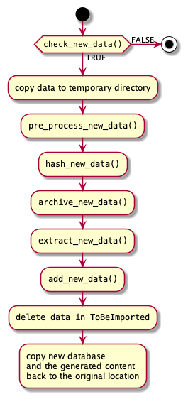{ width=100% }

The top levels are different repo names (here `master` and `LEEF`) and default values for all the repos (`default`).

It has the following keywords:
- `default` contaiuns self-explanatory values
- `doi` if TRUE, will request DOI after successfull commit
- `tts` if TRUE, will request Trusted Time Stamp of repo after successfull commit 
- `data` contains info about the data storage
- `backend` the name of the backend and connection info
- <span style="color:green">others to come</span>

This config file should be the same for all repos in a tree, but it is not necessary.

### `CONFIG.NAME`
This file contains the name of the configuration for this repo. in this example `master`.
So by changiong the content of this file to `LEEF`, this repo becomes a `LEEF` repo.


## Import of new data
Before new data can be imported, this repo needs to be forked. Once forked, all user interaction takes place via this fork and pull requests to this repo. This fork needs to be cloned to a local computer.

An import of new data follows the following steps:

1. Create a new branch on the local fork and check it out.
2. Add all new data files to the directory `inst/new_data/`. The data has to follow the following rules:
    - the data has to be in a common format, e.g. `.csv`
    - the name has to reflect the name of the table the data needs to be imported to
    - **<span style="color:red">metadata do be added in additional file?</span>**
    - **<span style="color:red">more?</span>**
3. commit these changes to the local fork and push to github fork
4. create pull request from this repo
5. an automatic check of the package will be triggered using Travis-ci, which will test the data and not the units if the `inst/newdata` directory is not empty
6. From now on in the `after_success section`
6. after a succerssfull testhat test, the data will be imported and the database updated
7. delete all imported files; if a file remains, raise error
8. update version in DESCRIPTION
7. the main vignette will be updated with date and (hopefully) timestamp of the data
8. changes will be commited to repo with 
9. quit


As soon as this repo receives a pull request, it initiates the import via a Travis job. This importing is handled within the package `LEEF.Processing` and can be seen in detail in the package documantation.

For relevance here are two actions:

1. `LEEF.Processing` does commit the imported data to this repository or to the external database. 

# Package structure

The Data package contains the code to

- `check_existing_...()` to check the existing data 
- `check_new_...()` to check the incoming new data 
- `merge_...()` to merge the new data into the existing data
- ...

In addition, it contains the function 

- `existing_data_ok()` which is doing all checks on the existing data
- `newData_ok()` which is doing all checks on the new data
- `merge_all()` which is doing all the merging

and finally

- `do_all()` which is doing everything in the order of
    1) `check_existing_data()`
    1) `check_new_data()`
    2) `merge_all()`    
    1) `existing_data_ok()`

```{plantuml leef.processing.content, eval = plantuml_installed, include = FALSE}
package "LEEF" {
!define Group(name) class "name" << (G,#FFAAAA) >>

  Group("Unit Check") {
  }

  Group("Data Check") {
    + check_existing_data(...)
    + check_new_data(...)
    ....
    + check_existing_...(...)
    + check_new_...(...)
  }
  

  Group("Data Merging") {
    + merge_all(repo_type = "master", ...)
    ....
    + merge_...(...)
  }

  Group("Diverse") {
    + do_all(repo_type = "master", ...)
    ....
    + updatePackageData(...)
  }
}
```

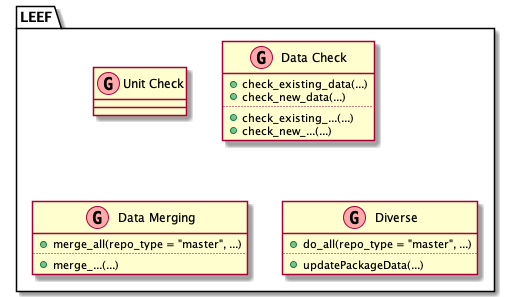{ width=100% }

## Activity Diagram of `import_new_data()` function
```{plantuml leef.processing.activity, eval = plantuml_installed, include = FALSE}
start
:""import_new_data(repo)"";
if (""check_existing_data()"") then (FALSE)
  stop
else (TRUE)
endif
if (check ""repo"") then 
  if (""check_new_data()"") then (FALSE)
    stop
  else (TRUE)
  endif
else (repo != "master")

note right
  Not sure if we should 
  really check
  ====
  Maybe different repos 
  do have different data checks?
end note

endif
:""clean_all()"";
:""add_new_data()"";
if (""check_existing_data()"") then (FALSE)
  stop
else (TRUE)
endif
:""process_all(repo)"";
```

# Database Structure
Layout Based on https://gist.github.com/QuantumGhost/0955a45383a0b6c0bc24f9654b3cb561

```{plantuml databaseModell2, eval = plantuml_installed, include = FALSE}
skinparam dpi 300
!define Table(name,desc) class name as "desc" << (T,#FFAAAA) >>
' we use bold for primary key
' green color for unique
' and underscore for not_null
!define primary_key(x) <b>x</b>
!define unique(x) <color:green>x</color>
!define not_null(x) <u>x</u>
!define field(x) <color:black>x</color>
' other tags available:
' <i></i>
' <back:COLOR></color>, where color is a color name or html color code
' (#FFAACC)
' see: http://plantuml.com/classes.html#More
hide methods
hide stereotypes

' entities

Table(import, "dapa_package (meta data from data package with TTS)") {
primary_key(tts_hash) INTEGER
import_data:
person_importing TEXT
date_import DATE
remarks TEXT
...
}

Table(bemovi, "bemovi (data from bemovi analysis)") {
primary_key(id) INTEGER
not_null(tts_hash) TEXT
bemovi_data:
...
}

Table(flowcam, "flowcam (data from flowcam analysis)") {
primary_key(id) INTEGER
not_null(tts_hash) TEXT
flowcam_data:
...
}

Table(flowcytometer, "flowcytometer (data from flowcytometer analysis)") {
primary_key(id) INTEGER
not_null(tts_hash) TEXT
flowcytometer_data:
...
}

Table(manualcount, "manualcount (data from manualcount analysis)") {
primary_key(id) INTEGER
not_null(tts_hash) TEXT
manualcount_data 
...
}

Table(respirometer, "respirometer (data from respirometer analysis)") {
primary_key(id) INTEGER
not_null(tts_hash) TEXT
respirometer_data:
...
}


' Table(user_profile, "user_profile (Some info of user)") {
' primary_key(user_id) INTEGER
' age SMALLINT
' gender SMALLINT
' birthday DATETIME
' }

' Table(group, "group (group of users)") {
' primary_key(id) INTEGER
' not_null(name) VARCHAR[32]
' }

' Table(user_group, "user_group (relationship of user and group)") {
' primary_key(user_id) INTEGER
' primary_key(group_id) INTEGER
' joined_at DATETIME
' }

' relationships
' one-to-one relationship
'   user -- user_profile : "A user only has one profile"

' one to may relationship
import --> bemovi : "tts_hash"
import --> flowcam : "tts_hash"
import --> flowcytometer : "tts_hash"
import --> manualcount : "tts_hash"
import --> respirometer : "tts_hash"


' many to many relationship
' Add mark if you like
'   user "1" --> "*" user_group : "A user may be in many groups"
'   group "1" --> "0..N" user_group : "A group may contain many users"
```

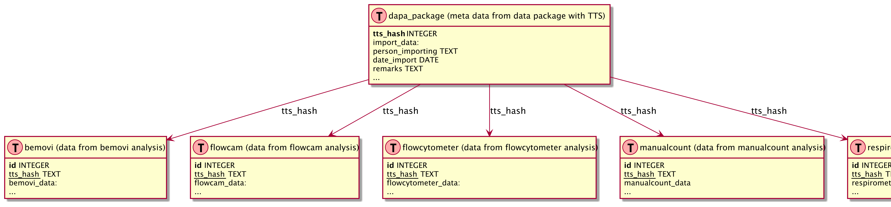{ width=100% }


    
    
    
    
    
